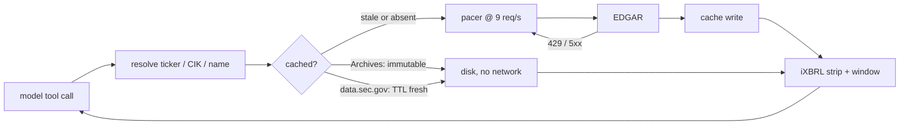

# edgar-mcp

An MCP server that gives a model working access to SEC EDGAR — company filings,
filing text, and XBRL financial facts.

[](https://github.com/asp53826/edgar-mcp/actions/workflows/ci.yml)


**→ [Interactive results page](https://asp53826.github.io/edgar-mcp/)** — fire a
burst of tool calls and watch a full token bucket sail through the limit it was
written to enforce, then see what each EDGAR host can actually validate.

> EDGAR will happily hand you a 9 MB filing and then throttle you for asking
> twice. The interesting part of this server is everything between the model and
> the wire.

## What is actually implemented

- ticker, CIK, or company name resolves to an EDGAR identity, with ambiguous
  names returning candidates instead of a silent wrong guess;
- filing history spans EDGAR's overflow files, so companies past ~1000 filings
  don't get silently truncated to the recent page;
- filing text arrives windowed with a `next_offset` cursor — a 10-K is ~206K
  characters and does not belong in a context window whole;
- inline-XBRL scaffolding is stripped, so extracted text starts at the prose
  and not at 11K characters of `false2025FY0000320193...`;
- XBRL concepts come back as a time series, with a tag-discovery tool because
  nobody knows the right us-gaap tag name off the top of their head;
- one metric can be ranked across every filer for a period via the frames API;
- full-text search covers filings from 2001 onward;
- requests are paced under SEC's 10 req/s ceiling even when a model fires a
  parallel burst of tool calls;
- responses are cached per-host by the freshness rule that host actually
  supports.



## Measured, not implied

Apple M-series, macOS, Python 3.13, live EDGAR. Reproduce with `make bench`.

| Check | Result |
|---|---:|
| Tests passing | **32** |
| `companyfacts` cold fetch | 3.75 MB / 97 ms |
| `companyfacts` warm read | **0.00 MB / 1.4 ms** (68×) |
| 10-K document cold fetch | 1.52 MB / 154 ms |
| 10-K document warm read | **0.00 MB / 1.1 ms** (138×) |
| `submissions` warm read | 0.00 MB / 0.2 ms (755×) |
| Sustained request rate | **9.2 req/s** |
| Peak requests in any 1s window | **10** (SEC ceiling: 10) |
| iXBRL scaffolding removed from a 10-K | 11,303 chars |
| Text extraction throughput | 23.4 MB/s |
| Windows to read a full 10-K @ 40K | 6 |

Both the cache and pacer numbers above are post-fix. The first benchmark run
reported a 3.75 MB "cache hit" that was really a full re-download, and 19
requests inside a one-second window against a 10 req/s limit. See
[DESIGN.md](DESIGN.md).

## Where it loses

- **Freshness on `data.sec.gov` is a guess.** That host sends no `ETag` and no
  `Last-Modified`, so conditional requests are impossible and freshness falls
  back to a 1-hour TTL. A filing that lands mid-TTL is invisible until it
  expires. Pass `ttl=0` if you need read-your-writes.
- **Windowing re-reads, it doesn't range-read.** EDGAR honors HTTP `Range` on
  Archives (verified: `206`, `accept-ranges: bytes`), but partial HTML can't be
  parsed reliably, so the whole document is fetched once and windowed from
  cache. The first call on a large filing pays the full download.
- **Search is never cached.** Results are query-shaped and EDGAR's full-text
  endpoint offers no validators, so every search is a live round trip against
  the 9 req/s budget.
- **The pacer is global.** Ten companies queried in parallel serialize at
  ~9 req/s. Correct, but not fast.
- **XBRL values are consolidated totals.** Dimensional breakdowns (by segment,
  by geography) exist in the data and this does not surface them.
- **Full-text search starts at 2001.** Older filings are reachable through
  `list_filings`, not `search_filings`.

## Verify it

```bash
make test    # 32 tests, no network
make bench   # live EDGAR, prints the table above
```

## Setup

SEC requires a User-Agent carrying a real contact address and blocks requests
without one. The server refuses to start rather than letting you discover that
as a confusing 403 later.

```bash
export EDGAR_USER_AGENT="your-project you@example.com"
```

Add to `claude_desktop_config.json` or `.mcp.json`:

```json
{
  "mcpServers": {
    "edgar": {
      "command": "uv",
      "args": ["run", "--directory", "/path/to/edgar-mcp", "edgar-mcp"],
      "env": { "EDGAR_USER_AGENT": "your-project you@example.com" }
    }
  }
}
```

## Tools

| Tool | Purpose |
|---|---|
| `lookup_company` | ticker / CIK / name → EDGAR identity |
| `list_filings` | filing history, filtered by form and date |
| `get_filing_text` | windowed document text, follow `next_offset` |
| `list_concepts` | which XBRL tags a company actually reports |
| `get_concept` | time series for one tag |
| `compare_concept` | one tag ranked across all filers for a period |
| `search_filings` | full-text search, 2001→ |
| `cache_stats` | hit rate, requests, bytes downloaded |

A typical chain is `lookup_company` → `list_filings` → `get_filing_text`, or
`list_concepts` → `get_concept` when you want numbers rather than prose.

## License

MIT
